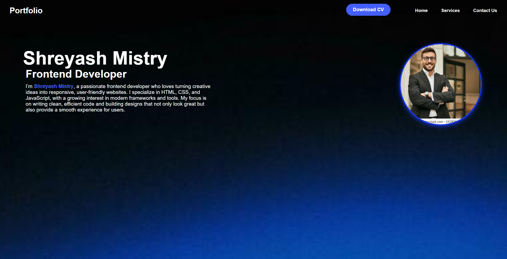
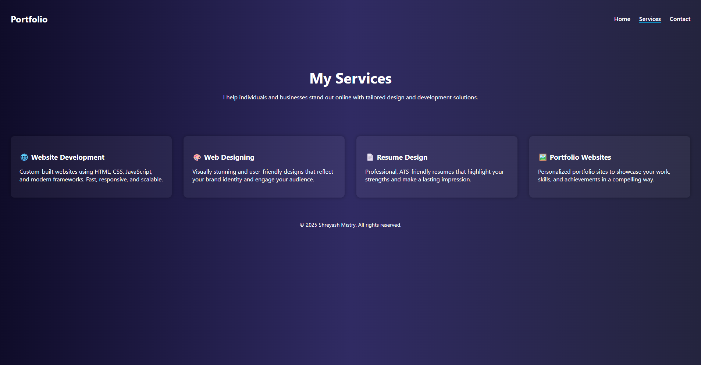
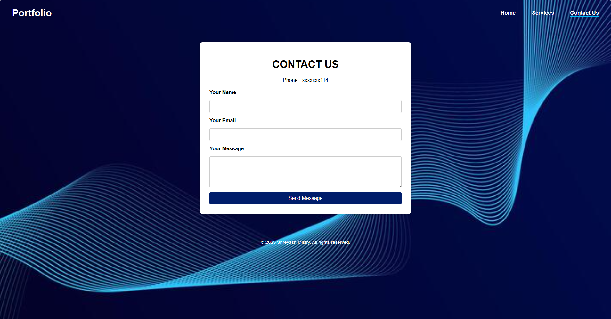

# Portfolio Website 🌐

A simple and modern **personal portfolio website** built with **HTML & CSS**.  
This project showcases my profile, skills, and resume download option as a **Frontend Developer**.

---

## 🚀 Features
- Responsive **navigation bar** with Home, Services, and Contact links  
- Stylish **hero section** with name, title, and description  
- Circular **profile image with shadow effect**  
- **Download CV button** with hover animation  
- Gradient background design  

---

## New Features
- **Service Page**
- **Contact Us Page**
- **New Background For Home Page**

## 🛠️ Technologies Used
- **HTML5**  
- **CSS3**  

---

## 📂 Project Structure
portfolio/
├── index.html # Main HTML file
├── style.css # CSS styling
├── image.jpg # Profile image
├── Shreyash-Mistry-CV.pdf # Downloadable CV
└── README.md # Project documentation

# 📸 Screenshot

---

## 📄 How to Use
1. Clone or download this repository  
2. Open `index.html` in your browser  
3. Replace `download.jpg` with your own profile picture  
4. Update `Shreyash-Mistry-CV.pdf` with your CV  

---

## 👤 Author
**Shreyash Mistry**  
Frontend Developer 🚀 | Passionate about building modern, responsive websites  

**Version**
3.2.0